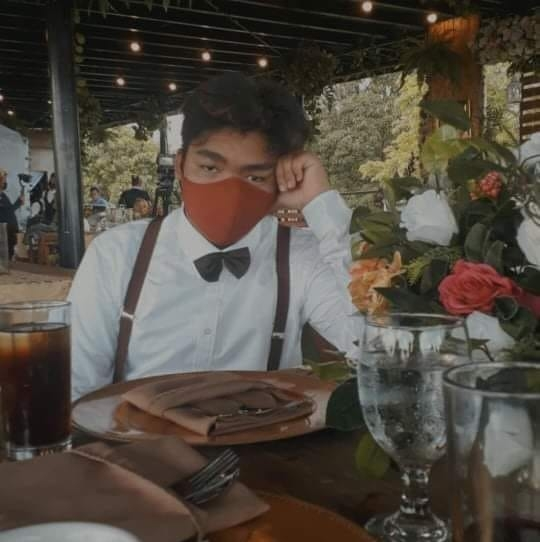

<html lang="en">
<head>
  <meta charset="UTF-8" />
  <meta name="viewport" content="width=device-width, initial-scale=1.0" />
  <title>Ericsson T. Pastores | Portfolio</title>
  
</head>
<body>
  <header>
    <h1>Ericsson T. Pastores</h1>
    
Web Developer | Designer | Programmer

    <nav>
      <ul>
        <li><a href="#about">About</a></li>
        <li><a href="#projects">Projects</a></li>
        <li><a href="#contact">Contact</a></li>
      </ul>
    </nav>
  </header>

  <section id="about">
    <h2>About Me</h2>
    
    
Hello! I'm Ericsson Pastores, a passionate individual with a knack for adapting quickly and a strong interest in computer programming. I love exploring new technologies, diving into games, and learning about how things work—especially cars and computers.

  </section>

  <section id="projects">
    <h2>Projects</h2>
    

      <h3>Lilipad Basket for Canals</h3>
      
This innovative project aims to mitigate the risk of flash floods by deploying floating baskets—resembling lily pads—in city canals. These baskets help collect debris and reduce water flow obstruction during heavy rains.

    

    

      <h3>Tools and Technologies Used</h3>
      <ul>
        <li>HTML</li>
        <li>CSS</li>
        <li>JavaScript</li>
        <li>ChatGPT</li>
        <li>Perplexity AI</li>
      </ul>
    

  </section>

  <section id="contact">
    <h2>Contact</h2>
    
Email me at <a href="mailto:etpastores.student@ua.edu.ph">etpastores.student@ua.edu.ph</a>

    
Connect with me on <a href="https://www.facebook.com/epstrs" target="_blank">Facebook</a>

  </section>

  <footer>
    
&copy; 2025 Ericsson T. Pastores. All rights reserved.

  </footer>
</body>
</html>
